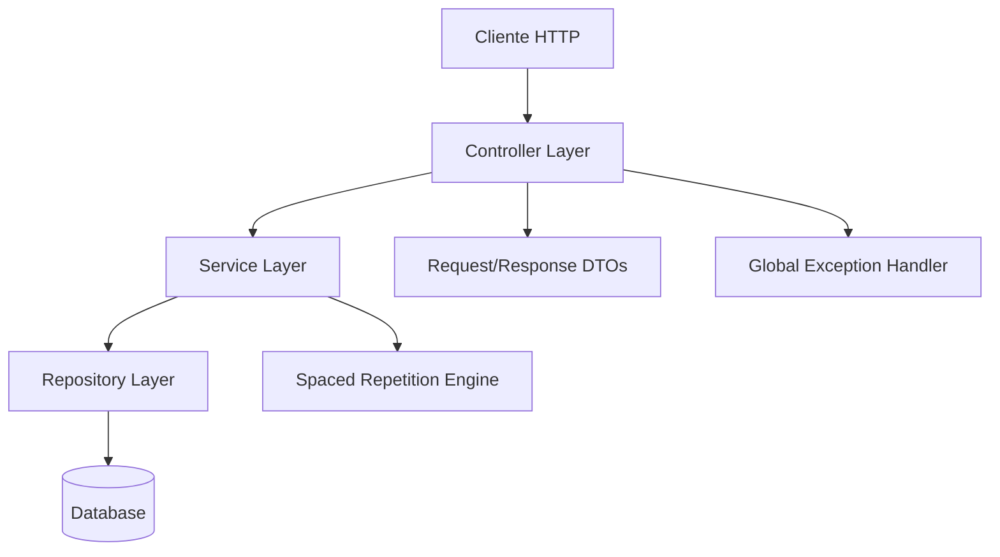
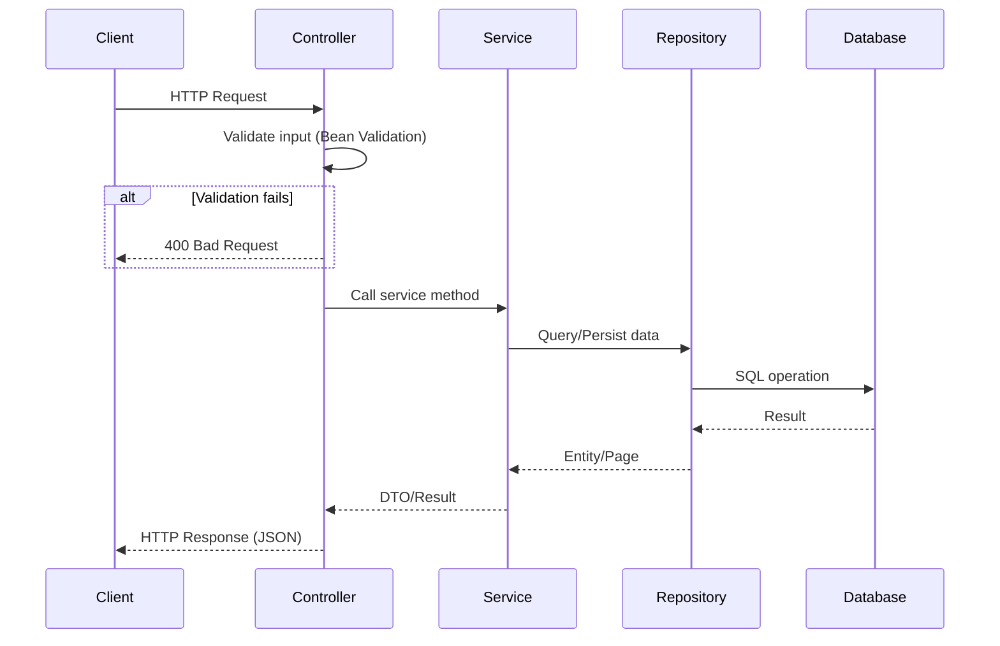
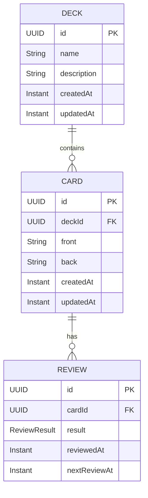

# Design Document: Flashcards API

## Overview

Este documento descreve o design técnico da API REST de Flashcards, uma aplicação Java/Spring Boot que permite a criação e gerenciamento de baralhos (decks) e cartões (cards), sessões de estudo com repetição espaçada, e visualização de estatísticas de desempenho.

A API segue princípios RESTful com paginação, validação consistente, tratamento de erros padronizado, e um motor de repetição espaçada simples baseado em intervalos fixos por resultado de revisão.

### Decisões de Design Principais

- **Spring Boot 3.x + Java 17+**: Framework moderno com suporte a Jakarta EE
- **Spring Data JPA + H2/PostgreSQL**: Persistência com JPA para abstração e flexibilidade de banco
- **Bean Validation (Jakarta Validation)**: Validação declarativa nos DTOs de entrada
- **UUID como identificador**: IDs universalmente únicos para todos os recursos
- **Paginação via Spring Data Pageable**: Mecanismo padrão com suporte a page/size
- **Algoritmo de repetição espaçada simplificado**: Intervalos fixos baseados no resultado (AGAIN: 1min, HARD: 10min, GOOD: 1 dia, EASY: 4 dias)

## Architecture

A aplicação segue uma arquitetura em camadas (layered architecture) típica de aplicações Spring Boot:



### Camadas

1. **Controller Layer**: Recebe requisições HTTP, valida entrada via Bean Validation, delega ao Service, e retorna respostas HTTP apropriadas.
2. **Service Layer**: Contém a lógica de negócio, orquestra operações entre repositórios, e aplica regras de negócio (como o cálculo de repetição espaçada).
3. **Repository Layer**: Interfaces Spring Data JPA para acesso a dados com queries customizadas quando necessário.
4. **Cross-cutting**: Exception handling global, DTOs para request/response, e o motor de repetição espaçada como componente utilitário.

### Fluxo de Requisição



## Components and Interfaces

### Controllers

| Controller | Base Path | Responsabilidade |
|---|---|---|
| `DeckController` | `/api/decks` | CRUD de Decks, listagem paginada |
| `CardController` | `/api/decks/{deckId}/cards`, `/api/cards/{id}` | CRUD de Cards, listagem com busca |
| `StudyController` | `/api/decks/{deckId}/study` | Cards prontos para revisão |
| `ReviewController` | `/api/cards/{id}/review` | Registro de resultado de revisão |
| `StatsController` | `/api/decks/{deckId}/stats` | Estatísticas de estudo |

### Services

| Service | Responsabilidade |
|---|---|
| `DeckService` | Lógica de negócio para Decks (CRUD, validação de existência) |
| `CardService` | Lógica de negócio para Cards (CRUD, busca por texto, cards para estudo) |
| `ReviewService` | Registro de revisões, cálculo de nextReviewAt |
| `StatsService` | Cálculo de estatísticas (totais, distribuição, streak) |
| `SpacedRepetitionEngine` | Cálculo do próximo intervalo de revisão |

### DTOs (Request/Response)

```java
// Requests
record CreateDeckRequest(@NotBlank @Size(max=100) String name, 
                         @Size(max=500) String description) {}

record UpdateDeckRequest(@NotBlank @Size(max=100) String name, 
                         @Size(max=500) String description) {}

record CreateCardRequest(@NotBlank @Size(max=5000) String front, 
                         @NotBlank @Size(max=5000) String back) {}

record UpdateCardRequest(@NotBlank @Size(max=5000) String front, 
                         @NotBlank @Size(max=5000) String back) {}

record CreateReviewRequest(@NotNull ReviewResult result) {}

// Responses
record DeckResponse(UUID id, String name, String description, 
                    Instant createdAt, Instant updatedAt) {}

record CardResponse(UUID id, UUID deckId, String front, String back, 
                    Instant createdAt, Instant updatedAt) {}

record ReviewResponse(UUID id, UUID cardId, ReviewResult result, 
                      Instant reviewedAt, Instant nextReviewAt) {}

record StatsResponse(int totalCards, int cardsStudied, int cardsDue,
                     long totalReviews, int studyStreak,
                     ResultDistribution resultDistribution) {}

record ResultDistribution(long easy, long good, long hard, long again) {}

// Error responses
record ValidationErrorResponse(Instant timestamp, int status, 
                                String error, List<String> messages) {}

record ErrorResponse(Instant timestamp, int status, 
                     String error, String message) {}
```

### Interfaces de Repositório

```java
interface DeckRepository extends JpaRepository<Deck, UUID> {
    Page<Deck> findAllByOrderByCreatedAtDesc(Pageable pageable);
}

interface CardRepository extends JpaRepository<Card, UUID> {
    Page<Card> findByDeckIdOrderByCreatedAtDesc(UUID deckId, Pageable pageable);
    
    Page<Card> findByDeckIdAndFrontContainingIgnoreCaseOrBackContainingIgnoreCase(
        UUID deckId, String frontTerm, String backTerm, Pageable pageable);
    
    List<Card> findCardsForStudy(UUID deckId, Instant now, Pageable pageable);
    
    int countByDeckId(UUID deckId);
    
    void deleteByDeckId(UUID deckId);
}

interface ReviewRepository extends JpaRepository<Review, UUID> {
    Optional<Review> findTopByCardIdOrderByReviewedAtDesc(UUID cardId);
    
    long countByCardIdIn(List<UUID> cardIds);
    
    List<Review> findByCardIdIn(List<UUID> cardIds);
    
    void deleteByCardId(UUID cardId);
    
    void deleteByCardIdIn(List<UUID> cardIds);
}
```

### Spaced Repetition Engine

```java
@Component
class SpacedRepetitionEngine {
    
    Instant calculateNextReview(Instant reviewedAt, ReviewResult result) {
        return switch (result) {
            case AGAIN -> reviewedAt.plus(1, ChronoUnit.MINUTES);
            case HARD  -> reviewedAt.plus(10, ChronoUnit.MINUTES);
            case GOOD  -> reviewedAt.plus(1, ChronoUnit.DAYS);
            case EASY  -> reviewedAt.plus(4, ChronoUnit.DAYS);
        };
    }
}
```

## Data Models

### Entidade Deck

```java
@Entity
@Table(name = "decks")
class Deck {
    @Id
    @GeneratedValue(strategy = GenerationType.UUID)
    private UUID id;
    
    @Column(nullable = false, length = 100)
    private String name;
    
    @Column(length = 500)
    private String description;
    
    @Column(nullable = false, updatable = false)
    private Instant createdAt;
    
    @Column(nullable = false)
    private Instant updatedAt;
}
```

### Entidade Card

```java
@Entity
@Table(name = "cards")
class Card {
    @Id
    @GeneratedValue(strategy = GenerationType.UUID)
    private UUID id;
    
    @Column(name = "deck_id", nullable = false)
    private UUID deckId;
    
    @Column(nullable = false, length = 5000)
    private String front;
    
    @Column(nullable = false, length = 5000)
    private String back;
    
    @Column(nullable = false, updatable = false)
    private Instant createdAt;
    
    @Column(nullable = false)
    private Instant updatedAt;
    
    @ManyToOne(fetch = FetchType.LAZY)
    @JoinColumn(name = "deck_id", insertable = false, updatable = false)
    private Deck deck;
}
```

### Entidade Review

```java
@Entity
@Table(name = "reviews")
class Review {
    @Id
    @GeneratedValue(strategy = GenerationType.UUID)
    private UUID id;
    
    @Column(name = "card_id", nullable = false)
    private UUID cardId;
    
    @Enumerated(EnumType.STRING)
    @Column(nullable = false)
    private ReviewResult result;
    
    @Column(nullable = false)
    private Instant reviewedAt;
    
    @Column(nullable = false)
    private Instant nextReviewAt;
    
    @ManyToOne(fetch = FetchType.LAZY)
    @JoinColumn(name = "card_id", insertable = false, updatable = false)
    private Card card;
}
```

### Enum ReviewResult

```java
enum ReviewResult {
    EASY, GOOD, HARD, AGAIN
}
```

### Diagrama ER




## Correctness Properties

*A property is a characteristic or behavior that should hold true across all valid executions of a system—essentially, a formal statement about what the system should do. Properties serve as the bridge between human-readable specifications and machine-verifiable correctness guarantees.*

### Property 1: Spaced Repetition Interval Calculation

*For any* valid `Instant` timestamp and *for any* `ReviewResult` value (EASY, GOOD, HARD, AGAIN), the `SpacedRepetitionEngine.calculateNextReview()` SHALL return the timestamp plus the exact interval defined: AGAIN → +1 minute, HARD → +10 minutes, GOOD → +1 day, EASY → +4 days.

**Validates: Requirements 12.4**

### Property 2: Deck Creation Round-Trip

*For any* valid deck name (1-100 non-blank characters) and optional description (0-500 characters), creating a Deck via POST and then fetching it by the returned ID SHALL return a Deck with the same name and description, plus valid auto-generated id (UUID), createdAt, and updatedAt fields.

**Validates: Requirements 1.1, 1.4, 3.1**

### Property 3: Card Creation Round-Trip

*For any* valid front and back content (1-5000 non-blank characters each) and an existing deckId, creating a Card via POST and then fetching it by the returned ID SHALL return a Card with the same front, back, and deckId, plus valid auto-generated id, createdAt, and updatedAt.

**Validates: Requirements 6.1, 6.6, 8.1**

### Property 4: Blank Input Rejection

*For any* string composed entirely of whitespace characters (including empty string), using it as a Deck name, Card front, or Card back SHALL result in HTTP 400 rejection, and the underlying collection SHALL remain unchanged.

**Validates: Requirements 1.2, 6.4, 9.3**

### Property 5: Deck Update Preserves CreatedAt

*For any* existing Deck and *for any* valid update payload, updating the Deck SHALL result in the same createdAt value, an updatedAt value that is greater than or equal to the original, and the name and description reflecting the new values.

**Validates: Requirements 4.1, 4.4**

### Property 6: Card Update Preserves Immutable Fields

*For any* existing Card and *for any* valid update payload (front and back with 1-5000 non-blank chars), updating the Card SHALL preserve createdAt and deckId unchanged, update updatedAt to a newer value, and reflect the new front and back content.

**Validates: Requirements 9.1, 9.4**

### Property 7: Cascade Deletion Leaves No Orphans

*For any* Deck with associated Cards and Reviews, deleting the Deck SHALL result in zero Cards and zero Reviews associated with that Deck remaining in the database.

**Validates: Requirements 5.3, 10.1, 10.4**

### Property 8: Study Set Correctness

*For any* Deck containing Cards with varying review states, the study endpoint SHALL return only Cards that either (a) have never been reviewed, or (b) have their most recent Review's nextReviewAt ≤ current server time. No Card with nextReviewAt in the future SHALL appear in the result.

**Validates: Requirements 11.1, 11.3, 11.4**

### Property 9: Study Set Ordering

*For any* study result set, Cards never reviewed SHALL appear before Cards with past nextReviewAt. Among never-reviewed Cards, they SHALL be ordered by createdAt ascending. Among due Cards, they SHALL be ordered by nextReviewAt ascending.

**Validates: Requirements 11.6**

### Property 10: Study Set Size Limit

*For any* Deck regardless of how many Cards are due, the study endpoint SHALL return at most 20 Cards.

**Validates: Requirements 11.5**

### Property 11: Pagination Metadata Consistency

*For any* paginated listing endpoint (decks or cards), given a total of N items, page P, and size S, the response SHALL satisfy: `totalElements == N`, `totalPages == ceil(N/S)`, `number == P`, `size == S`, and `content.length == min(S, N - P*S)` when P is valid.

**Validates: Requirements 2.1, 2.2, 7.1, 7.4**

### Property 12: Invalid Pagination Rejection

*For any* page value < 0 or size value < 1 or size value > 100, the paginated endpoints SHALL return HTTP 400.

**Validates: Requirements 2.5, 7.7**

### Property 13: Card Search Filter Correctness

*For any* non-blank search term q and a Deck containing Cards, the filtered results SHALL only include Cards where front or back contains q as a case-insensitive substring. No Card matching the term SHALL be excluded from results (within the current page).

**Validates: Requirements 7.3**

### Property 14: Stats Computation Correctness

*For any* Deck with a known set of Cards and Reviews, the stats endpoint SHALL return: `totalCards` equal to the Card count, `cardsStudied` equal to the count of Cards with at least one Review, `cardsDue` equal to the count of Cards either never reviewed or with nextReviewAt ≤ now, `totalReviews` equal to the total Review count, and `resultDistribution` matching the actual count per ReviewResult value.

**Validates: Requirements 13.1, 13.3**

### Property 15: Study Streak Calculation

*For any* sequence of Review timestamps in a Deck, the studyStreak SHALL equal the number of consecutive days (counting backwards from today) that have at least one Review. If today has no Reviews, studyStreak SHALL be 0.

**Validates: Requirements 13.4**

### Property 16: Error Response Structure Consistency

*For any* error response (400, 404, 405, 500), the response SHALL have Content-Type `application/json` and contain at minimum the fields: `timestamp` (ISO 8601 format), `status` (numeric HTTP code), and `error` (description string).

**Validates: Requirements 14.1, 14.2, 14.5**

### Property 17: Listing Order Invariant

*For any* paginated deck listing, the results SHALL be ordered by createdAt descending — that is, for any two consecutive items in the list, the first item's createdAt SHALL be greater than or equal to the second item's createdAt.

**Validates: Requirements 2.4**

## Error Handling

### Estratégia de Tratamento de Erros

A API utiliza um `@RestControllerAdvice` global (`GlobalExceptionHandler`) que intercepta exceções e as converte em respostas JSON padronizadas.

### Tipos de Erro e Mapeamento

| Exceção | HTTP Status | Response Type |
|---|---|---|
| `MethodArgumentNotValidException` | 400 | `ValidationErrorResponse` (com lista de messages por campo) |
| `ConstraintViolationException` | 400 | `ValidationErrorResponse` |
| `InvalidFormatException` (enum inválido) | 400 | `ValidationErrorResponse` |
| `MethodArgumentTypeMismatchException` (UUID inválido) | 400 | `ErrorResponse` |
| `ResourceNotFoundException` | 404 | `ErrorResponse` (com recurso e ID) |
| `HttpRequestMethodNotSupportedException` | 405 | `ErrorResponse` (com métodos permitidos) |
| `Exception` (genérica) | 500 | `ErrorResponse` (mensagem fixa, sem detalhes técnicos) |

### Formato de Resposta de Erro

**Validação (400):**
```json
{
  "timestamp": "2024-01-15T10:30:00Z",
  "status": 400,
  "error": "Validation Error",
  "messages": [
    "name: must not be blank",
    "description: size must be between 0 and 500"
  ]
}
```

**Recurso não encontrado (404):**
```json
{
  "timestamp": "2024-01-15T10:30:00Z",
  "status": 404,
  "error": "Not Found",
  "message": "Deck not found with id: 550e8400-e29b-41d4-a716-446655440000"
}
```

**Erro interno (500):**
```json
{
  "timestamp": "2024-01-15T10:30:00Z",
  "status": 500,
  "error": "Internal Server Error",
  "message": "An unexpected error occurred. Please try again later."
}
```

### Exceção Customizada

```java
class ResourceNotFoundException extends RuntimeException {
    private final String resourceName;
    private final String fieldName;
    private final Object fieldValue;
    
    // Construtor e getters
}
```

### Princípios

1. **Nunca expor detalhes de implementação** — Stack traces, queries SQL, e nomes de classes internas nunca aparecem em respostas de erro.
2. **Mensagens úteis para o cliente** — Erros de validação indicam exatamente qual campo falhou e por quê.
3. **Consistência** — Todas as respostas de erro seguem o mesmo formato JSON, facilitando tratamento no cliente.
4. **Logging interno** — Erros 500 são logados com detalhes completos no servidor, mas a resposta ao cliente contém apenas mensagem genérica.

## Testing Strategy

### Abordagem de Testes

A estratégia de testes segue uma abordagem dual:

1. **Testes de Propriedade (Property-Based Tests)**: Validam propriedades universais usando geração aleatória de dados com mínimo de 100 iterações por propriedade.
2. **Testes Unitários/de Integração (Example-Based Tests)**: Validam cenários específicos, edge cases e integrações.

### Biblioteca de Property-Based Testing

- **jqwik** (https://jqwik.net/): Framework de PBT para Java que integra com JUnit 5.
- Configuração: mínimo 100 tentativas por propriedade (`@Property(tries = 100)`)
- Cada teste referencia a propriedade de design via tag: `@Tag("Feature: flashcards-api, Property N: ...")`

### Estrutura de Testes

```
src/test/java/
├── property/                    # Property-based tests
│   ├── SpacedRepetitionEnginePropertyTest.java    # Property 1
│   ├── DeckCrudPropertyTest.java                  # Properties 2, 5, 7, 17
│   ├── CardCrudPropertyTest.java                  # Properties 3, 4, 6, 7
│   ├── StudyPropertyTest.java                     # Properties 8, 9, 10
│   ├── PaginationPropertyTest.java                # Properties 11, 12
│   ├── SearchPropertyTest.java                    # Property 13
│   ├── StatsPropertyTest.java                     # Properties 14, 15
│   └── ErrorHandlingPropertyTest.java             # Property 16
├── unit/                        # Unit tests
│   ├── SpacedRepetitionEngineTest.java
│   ├── DeckServiceTest.java
│   ├── CardServiceTest.java
│   ├── ReviewServiceTest.java
│   └── StatsServiceTest.java
└── integration/                 # Integration tests (Spring Boot Test)
    ├── DeckControllerIntegrationTest.java
    ├── CardControllerIntegrationTest.java
    ├── StudyControllerIntegrationTest.java
    ├── ReviewControllerIntegrationTest.java
    └── StatsControllerIntegrationTest.java
```

### Property Tests — Configuração

Cada property test deve:
- Utilizar `@Property(tries = 100)` do jqwik
- Referenciar a propriedade de design com `@Tag("Feature: flashcards-api, Property N: <título>")`
- Utilizar `@ForAll` com arbitraries customizados para gerar dados válidos
- Utilizar `@SpringBootTest` com banco H2 em memória para testes que precisam de persistência

### Example-Based Tests — Cobertura

Os testes unitários/integração cobrem:
- Cenários de sucesso específicos (criação com dados exatos, listagem vazia)
- Edge cases (UUID inválido, campo ausente, string nula)
- Comportamento de defaults (paginação padrão, description opcional)
- Cenários de erro (404, 400, 405, 500)
- Cascata de deleção com dados concretos
- Verificação de Content-Type em respostas de erro

### Dependências de Teste

```kotlin
// build.gradle.kts
dependencies {
    testImplementation("net.jqwik:jqwik-spring:0.14.0")
    testImplementation("net.jqwik:jqwik:1.8.5")
    testImplementation("com.h2database:h2")
}
```

### Arbitraries Customizados (Geradores)

```java
class FlashcardArbitraries {
    @Provide
    Arbitrary<String> validDeckNames() {
        return Arbitraries.strings()
            .ofMinLength(1).ofMaxLength(100)
            .filter(s -> !s.isBlank());
    }
    
    @Provide
    Arbitrary<String> validCardContent() {
        return Arbitraries.strings()
            .ofMinLength(1).ofMaxLength(5000)
            .filter(s -> !s.isBlank());
    }
    
    @Provide
    Arbitrary<String> blankStrings() {
        return Arbitraries.of("", " ", "  ", "\t", "\n", "   \t\n  ");
    }
    
    @Provide
    Arbitrary<ReviewResult> reviewResults() {
        return Arbitraries.of(ReviewResult.values());
    }
    
    @Provide
    Arbitrary<Instant> timestamps() {
        return Arbitraries.longs()
            .between(0, Instant.now().getEpochSecond())
            .map(Instant::ofEpochSecond);
    }
}
```
